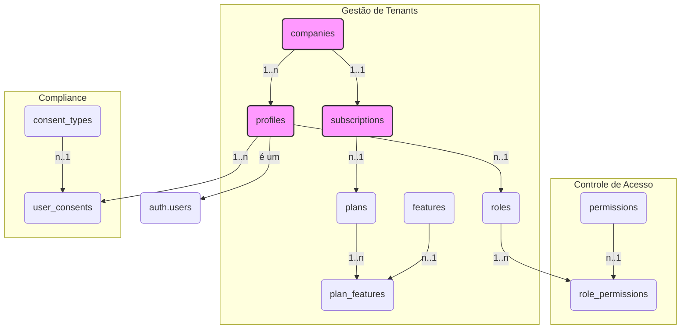
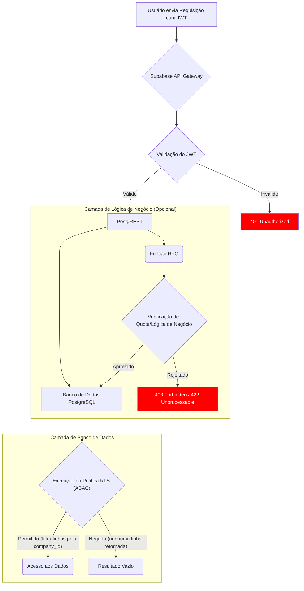

# 1. Arquitetura do Sistema

Este documento descreve a arquitetura geral do sistema, as decisões tecnológicas e os principais fluxos de dados.

## 1.1. Justificativa da Stack Tecnológica

A escolha da stack foi baseada na busca por agilidade no desenvolvimento, baixo custo de manutenção e escalabilidade.

-   **Frontend (Low-Code): WeWeb**
    -   **Justificativa:** Permite a construção de interfaces de usuário complexas de forma visual e rápida, sem sacrificar a flexibilidade para adicionar lógica customizada. Ideal para acelerar o time-to-market.

-   **Backend (BaaS): Supabase**
    -   **Justificativa:** Oferece uma solução backend completa com autenticação, banco de dados PostgreSQL e APIs auto-geradas. A integração nativa com o PostgreSQL e o suporte a Row Level Security (RLS) são cruciais para a nossa arquitetura multi-tenant.

## 1.2. Arquitetura Multi-Tenant

A segurança e o isolamento dos dados entre as diferentes empresas (tenants) são a principal prioridade desta arquitetura.

-   **Isolamento de Dados:** Implementado diretamente no banco de dados PostgreSQL através de **Row Level Security (RLS)**.
-   **Chave de Tenant (`company_id`):** Todas as tabelas que contêm dados específicos de um tenant possuem uma coluna `company_id`.
-   **Políticas de RLS:** Políticas de segurança são aplicadas a cada tabela para garantir que as queries (SELECT, INSERT, UPDATE, DELETE) de um usuário autenticado só possam acessar os dados que pertencem à sua `company_id`. O `company_id` do usuário é obtido a partir do seu token JWT durante a sessão.

## 1.3. Diagrama de Componentes

A arquitetura é composta pelos seguintes componentes principais:
-   **Frontend (WeWeb):** A interface do usuário (UI) construída na plataforma low-code WeWeb.
-   **Backend (Supabase):** A plataforma BaaS que fornece os serviços de backend.
    -   **Supabase Auth:** Gerencia identidade, login, MFA e JWTs.
    -   **Supabase Database (PostgreSQL):** O banco de dados relacional com RLS.
    -   **Supabase Storage:** Armazena ficheiros de forma segura.
    -   **Supabase Edge Functions:** Lógica de negócio serverless para orquestração e integrações.
-   **Gateway de Pagamentos (Ex: Stripe):** Serviço externo para processar pagamentos e gerenciar assinaturas.

## 1.4. Diagramas Visuais

### 1.4.1. Diagrama de Entidade-Relacionamento (Conceitual)

O diagrama abaixo ilustra as principais entidades do sistema e seus relacionamentos, com foco nas tabelas de gestão de tenants, usuários, assinaturas e permissões.

*Para uma descrição detalhada de cada tabela e seus campos, consulte o documento [Esquema da Base de Dados](./03-database-schema.md).*

### 1.4.2. Fluxograma de Acesso e Autorização

Este fluxograma demonstra como o sistema combina RBAC e ABAC para autorizar uma requisição de um usuário.

## 1.5. Padrões de Arquitetura

Para garantir a robustez, escalabilidade e segurança do sistema, adotamos os seguintes padrões:

### 1.5.1. Arquitetura Híbrida RBAC + ABAC

Nosso sistema de controle de acesso combina dois modelos para máxima flexibilidade:
-   **RBAC (Role-Based Access Control):** Define "o que" um usuário pode fazer. Os papéis (`roles`) concedem permissões para ações específicas. A gestão de papéis e permissões é detalhada em [FR-002-rbac-and-permissions.md](./04-functional-requirements/FR-002-rbac-and-permissions.md).
-   **ABAC (Attribute-Based Access Control):** Define "sobre quais dados" uma ação pode ser executada. Este controle é implementado via **Row Level Security (RLS)**, que atua como o principal mecanismo de isolamento de dados, um requisito chave detalhado em [Requisitos Não-Funcionais](./05-non-functional-requirements.md#rnf-01-segurança).

### 1.5.2. Orquestração de Registo (Padrão Saga)

Operações complexas que envolvem múltiplos passos (e.g., cadastro de usuário com criação de assinatura) são tratadas como uma "Saga" para garantir a consistência dos dados.
-   **Orquestrador:** Uma Edge Function atua como o orquestrador do fluxo.
-   **Compensação (Rollback Lógico):** Se um passo falhar, o orquestrador executa ações de compensação para reverter os passos concluídos. Esta abordagem é fundamental para a nossa política de [Confiabilidade e Resiliência](./05-non-functional-requirements.md#rnf-05-confiabilidade-e-resiliência).

### 1.5.3. Política de Idempotência

Operações críticas são protegidas contra execução duplicada através de uma política de idempotência. O cliente gera uma chave única que o backend verifica.
-   Este contrato é formalizado no documento [Contratos e Políticas da API](./07-api-contracts-and-policies.md).
-   A validação deste comportamento é um cenário crítico em nossa [Estratégia de Testes](./08-operations-and-testing.md#822-cenários-de-teste-críticos-end-to-end).

### 1.5.4. Governança de Papéis

O sistema distingue entre dois tipos de papéis para uma governança clara:
-   **Papéis de Sistema:** Globais e definidos pela equipe de desenvolvimento (`company_id` é `NULL`).
-   **Papéis Personalizados:** Específicos do tenant e gerenciados pelos administradores do tenant.
-   Os requisitos detalhados para esta funcionalidade estão em [FR-002-rbac-and-permissions.md](./04-functional-requirements/FR-002-rbac-and-permissions.md).
