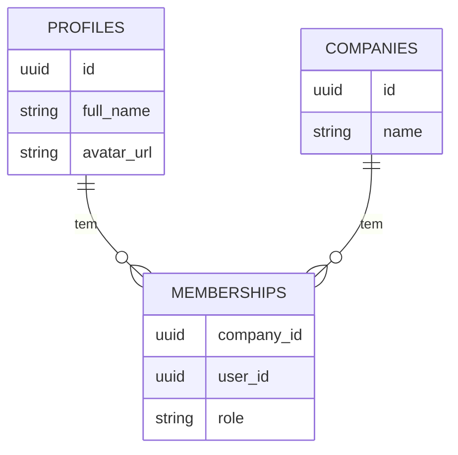

# 1.2 Modelo de Dados

Esta seção descreve as principais entidades de dados do sistema e como elas se relacionam. Para um detalhe completo das tabelas e colunas, consulte a seção [Base de Dados](../3-base-de-dados/).

## Entidades Principais

- **Profiles (Utilizadores)**: Representa um utilizador individual no sistema. Cada utilizador que se autentica tem um `profile`. Está ligado diretamente à tabela `auth.users` do Supabase.

- **Companies (Empresas/Organizações)**: Representa uma entidade de negócio ou uma organização. Um utilizador pode pertencer a uma ou mais empresas. Este é o nosso conceito de "tenant" principal.

- **Memberships (Vínculos)**: É a tabela de junção que define a relação entre um `profile` e uma `company`. Ela armazena também o papel (`role`) do utilizador dentro daquela empresa (ex: `admin`, `member`).

## Relacionamentos Chave

- Um `Profile` pode ter muitos `Memberships`.
- Uma `Company` pode ter muitos `Memberships`.
- Portanto, a relação entre `Profiles` e `Companies` é de muitos-para-muitos (N:M), através da tabela `Memberships`.

## Diagrama de Entidade-Relacionamento Simplificado

_Um diagrama simplificado pode ser inserido aqui para ilustrar as relações._

