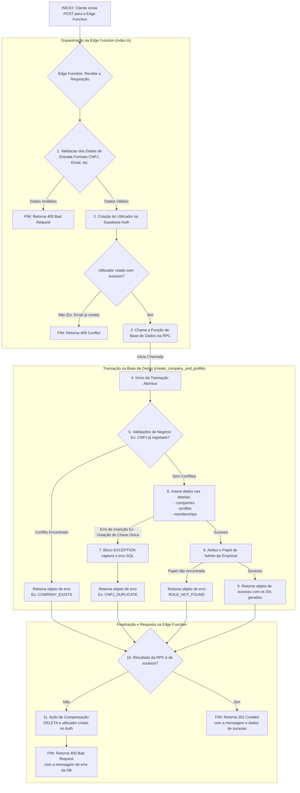

# Documentação Detalhada do Processo de Registo de Empresa e Utilizador

## Introdução

Este documento oferece uma análise aprofundada do fluxo de registo de uma nova empresa e do seu primeiro utilizador no sistema. O processo foi desenhado para ser robusto, seguro e consistente, dividindo as responsabilidades entre uma **Edge Function** (orquestradora) e uma **Função de Base de Dados** (executora da lógica de negócio).

O fluxograma abaixo apresenta uma visão geral do processo, que será detalhado nos capítulos seguintes.

> **Nota:** O diagrama abaixo é um fluxograma gerado com a sintaxe Mermaid. Em plataformas como o GitHub, ele será renderizado como um gráfico visual.



---

## Parte 1: A Orquestradora - Edge Function (`index.ts`)

### 1.1. Introdução à Edge Function

A Edge Function atua como o ponto de entrada da API e a principal orquestradora do fluxo. As suas responsabilidades são:

- Receber a requisição do cliente.
- Validar a formatação e a integridade dos dados de entrada.
- Gerir a sequência de operações: primeiro a criação do utilizador no serviço de autenticação e depois a criação dos dados da empresa na base de dados.
- Lidar com erros de forma inteligente, executando ações de compensação (rollback) para manter a consistência dos dados.
- Formatar e retornar a resposta final (sucesso ou erro) para o cliente.

### 1.2. Código-Fonte (`index.ts`)

```typescript
// Ficheiro: supabase/functions/create_company_and_user/index.ts
import { serve } from 'https://deno.land/std@0.177.0/http/server.ts';
import { createClient } from 'https://esm.sh/@supabase/supabase-js@2';

// Define os cabeçalhos CORS
const corsHeaders = {
  'Access-Control-Allow-Origin': '*',
  'Access-Control-Allow-Headers': 'authorization, x-client-info, apikey, content-type'
};

// Função auxiliar para validar CNPJ (formato básico)
function validateCNPJ(cnpj) {
  // Remove caracteres não numéricos
  const cleanCNPJ = cnpj.replace(/[^\d]/g, '');
  // Verifica se tem 14 dígitos
  if (cleanCNPJ.length !== 14) {
    return false;
  }
  // Verifica se todos os dígitos são iguais (CNPJ inválido)
  if (/^(\d)\1{13}$/.test(cleanCNPJ)) {
    return false;
  }
  return true;
}

// Função auxiliar para validar telefone
function validatePhone(phone) {
  // Remove caracteres não numéricos
  const cleanPhone = phone.replace(/[^\d]/g, '');
  // Verifica se tem entre 10 e 11 dígitos (com DDD)
  return cleanPhone.length >= 10 && cleanPhone.length <= 11;
}

// Função auxiliar para formatar mensagens de erro para o usuário
function getUserFriendlyError(errorCode, defaultMessage) {
  const errorMessages = {
    'INVALID_CNPJ': 'O CNPJ informado é inválido. Verifique e tente novamente.',
    'INVALID_COMPANY_NAME': 'O nome da empresa é obrigatório.',
    'INVALID_PHONE': 'O número de telefone informado é inválido. Use o formato (XX) XXXXX-XXXX.',
    'INVALID_EMAIL': 'O email informado é inválido.',
    'INVALID_PASSWORD': 'A senha deve ter no mínimo 6 caracteres.',
    'INVALID_NAME': 'O nome completo é obrigatório.',
    'USER_ALREADY_MEMBER': 'Você já está cadastrado nesta empresa.',
    'COMPANY_EXISTS': 'Este CNPJ já está cadastrado. Se você precisa acessar esta empresa, solicite ao administrador.',
    'PROFILE_EXISTS': 'Este email já está cadastrado no sistema.',
    'ROLE_NOT_FOUND': 'Erro de configuração do sistema. Por favor, contacte o suporte técnico.',
    'CNPJ_DUPLICATE': 'Este CNPJ já está em uso por outra empresa.',
    'EMAIL_EXISTS': 'Este email já está cadastrado. Faça login ou use outro email.',
    'INTERNAL_ERROR': 'Ocorreu um erro inesperado. Tente novamente em alguns instantes.'
  };
  return errorMessages[errorCode] || defaultMessage;
}

serve(async (req)=>{
  // Trata requisições OPTIONS para CORS
  if (req.method === 'OPTIONS') {
    return new Response('ok', {
      headers: corsHeaders
    });
  }
  try {
    // 1. Extração e Validação dos Dados
    const requestData = await req.json();
    const { company_data, user_data } = requestData;
    // Validações detalhadas
    const validationErrors = [];
    if (!company_data) {
      validationErrors.push('Dados da empresa são obrigatórios');
    }
    if (!user_data) {
      validationErrors.push('Dados do usuário são obrigatórios');
    }
    if (!company_data || !user_data) {
      return new Response(JSON.stringify({
        error: 'Dados inválidos',
        error_code: 'MISSING_DATA',
        details: validationErrors,
        user_message: validationErrors.join('. ')
      }), {
        status: 400,
        headers: {
          ...corsHeaders,
          'Content-Type': 'application/json'
        }
      });
    }

    if (!company_data.name || String(company_data.name).trim() === '') {
      validationErrors.push('Nome da empresa é obrigatório');
    }
    if (!company_data.cnpj || String(company_data.cnpj).trim() === '') {
      validationErrors.push('CNPJ é obrigatório');
    } else if (!validateCNPJ(String(company_data.cnpj))) {
      validationErrors.push('CNPJ inválido. Use o formato XX.XXX.XXX/XXXX-XX');
    }
    if (!user_data.email || String(user_data.email).trim() === '') {
      validationErrors.push('Email é obrigatório');
    } else if (!/^[^\s@]+@[^\s@]+\.[^\s@]+$/.test(String(user_data.email).trim())) {
      validationErrors.push('Email inválido');
    }
    if (!user_data.password) {
      validationErrors.push('Senha é obrigatória');
    } else if (String(user_data.password).length < 6) {
      validationErrors.push('A senha deve ter no mínimo 6 caracteres');
    }
    if (!user_data.full_name || String(user_data.full_name).trim() === '') {
      validationErrors.push('Nome completo é obrigatório');
    }
    if (!user_data.phone || String(user_data.phone).trim() === '') {
      validationErrors.push('Telefone é obrigatório');
    } else if (!validatePhone(String(user_data.phone))) {
      validationErrors.push('Telefone inválido. Use o formato (XX) XXXXX-XXXX');
    }

    if (validationErrors.length > 0) {
      return new Response(JSON.stringify({
        error: 'Dados inválidos',
        error_code: 'VALIDATION_ERROR',
        details: validationErrors,
        user_message: validationErrors.join('. ')
      }), {
        status: 400,
        headers: {
          ...corsHeaders,
          'Content-Type': 'application/json'
        }
      });
    }

    // 2. Limpar dados
    const cleanCNPJ = String(company_data.cnpj).replace(/[^\d]/g, '');
    const cleanPhone = String(user_data.phone).replace(/[^\d]/g, '');

    // 3. Criar cliente Supabase Admin
    const supabaseAdmin = createClient(Deno.env.get('SUPABASE_URL'), Deno.env.get('SUPABASE_SERVICE_ROLE_KEY'));

    // 4. Criar usuário no Auth
    const { data: authData, error: authError } = await supabaseAdmin.auth.admin.createUser({
      email: String(user_data.email).toLowerCase().trim(),
      password: String(user_data.password),
      email_confirm: true,
      user_metadata: {
        full_name: String(user_data.full_name).trim(),
        phone: cleanPhone,
        email_verified: true,
        phone_verified: false
      },
      app_metadata: {
        provider: 'email',
        providers: ['email']
      }
    });

    if (authError) {
      let userMessage = 'Erro ao criar usuário';
      if (authError.message.includes('already registered') || authError.message.includes('already exists')) {
        userMessage = 'Este email já está cadastrado. Faça login ou use outro email.';
      }
      return new Response(JSON.stringify({
        error: authError.message,
        user_message: userMessage
      }), {
        status: 409,
        headers: {
          ...corsHeaders,
          'Content-Type': 'application/json'
        }
      });
    }
    const userId = authData.user.id;
    try {
      // 5. Chamar RPC para criar empresa e perfil
      const { data: rpcResult, error: rpcError } = await supabaseAdmin.rpc('create_company_and_profile', {
        p_user_id: userId,
        p_company_name: String(company_data.name).trim(),
        p_company_cnpj: cleanCNPJ,
        p_user_full_name: String(user_data.full_name).trim(),
        p_user_phone: cleanPhone
      });

      if (rpcError) throw rpcError;

      if (rpcResult && typeof rpcResult === 'object' && rpcResult.success === false) {
        const userMessage = getUserFriendlyError(rpcResult.error_code, rpcResult.error_message);
        // Fazer rollback do usuário criado
        await supabaseAdmin.auth.admin.deleteUser(userId);
        return new Response(JSON.stringify({
          error: rpcResult.error_message,
          error_code: rpcResult.error_code,
          user_message: userMessage
        }), {
          status: 400,
          headers: {
            ...corsHeaders,
            'Content-Type': 'application/json'
          }
        });
      }

      // 6. Sucesso
      return new Response(JSON.stringify({
        success: true,
        userId: userId,
        companyId: rpcResult?.company_id,
        membershipId: rpcResult?.membership_id,
        message: 'Empresa e usuário criados com sucesso!'
      }), {
        status: 201,
        headers: {
          ...corsHeaders,
          'Content-Type': 'application/json'
        }
      });
    } catch (dbError) {
      // Compensação: Deletar usuário se a criação da empresa falhou
      await supabaseAdmin.auth.admin.deleteUser(userId);
      let userMessage = 'Erro ao criar empresa. Tente novamente.';
      if (dbError.code === '23505') { // unique_violation
        userMessage = 'Este CNPJ já está cadastrado no sistema.';
      }
      return new Response(JSON.stringify({
        error: 'Falha ao criar empresa',
        technical_details: dbError.message,
        user_message: userMessage
      }), {
        status: 500,
        headers: {
          ...corsHeaders,
          'Content-Type': 'application/json'
        }
      });
    }
  } catch (error) {
    return new Response(JSON.stringify({
      error: 'Erro interno do servidor',
      user_message: 'Ocorreu um erro inesperado. Por favor, tente novamente em alguns instantes.'
    }), {
      status: 500,
      headers: {
        ...corsHeaders,
        'Content-Type': 'application/json'
      }
    });
  }
});
```

### 1.3. Desenvolvimento: Etapas de Execução (Explicação)

- **Receção e Validação de Dados:**
  - A função é acionada por uma requisição `POST`. Primeiramente, ela lida com requisições `OPTIONS` para permitir o Cross-Origin Resource Sharing (CORS).
  - Em seguida, extrai os objetos `company_data` e `user_data` do corpo da requisição.
  - Um bloco de validação robusto verifica cada campo obrigatório (nome da empresa, CNPJ, email, senha, nome completo, telefone), utilizando funções auxiliares como `validateCNPJ` e `validatePhone`.
  - **Resultado:** Se qualquer dado for inválido ou estiver em falta, a função pára imediatamente e retorna um erro **400 Bad Request**, incluindo uma lista de todos os problemas encontrados para que o cliente possa corrigi-los de uma só vez.

- **Criação do Utilizador no Supabase Auth:**
  - Com os dados validados, a primeira operação de escrita é a criação do utilizador no serviço de autenticação da Supabase (`supabaseAdmin.auth.admin.createUser`).
  - Os metadados do utilizador, como nome completo e telefone, são armazenados diretamente no objeto de autenticação. O email é automaticamente confirmado (`email_confirm: true`).
  - **Resultado:** Se o email já existir, a Supabase retorna um erro. A Edge Function captura esse erro e responde ao cliente com **409 Conflict**, informando que o email já está em uso. Se a criação for bem-sucedida, o `userId` gerado é guardado para os próximos passos.

- **Invocação da Lógica de Negócio na Base de Dados:**
  - Com um utilizador válido criado no Auth, a Edge Function invoca a função `create_company_and_profile` na base de dados via RPC (Remote Procedure Call).
  - Ela passa todos os dados necessários como parâmetros: `userId`, nome da empresa, CNPJ, nome completo e telefone do utilizador.

- **Tratamento do Resultado e Ação de Compensação:**
  - Este é o ponto mais crítico da orquestração. A Edge Function aguarda o resultado da RPC.
  - **Cenário de Falha:** Se a função da base de dados retornar um erro (seja por uma regra de negócio, como CNPJ duplicado, ou um erro técnico), a Edge Function executa uma **ação de compensação**: ela chama `supabaseAdmin.auth.admin.deleteUser(userId)` para apagar o utilizador que tinha acabado de criar. Isto evita "utilizadores órfãos" no sistema de autenticação, que não estão ligados a nenhuma empresa. Após a limpeza, retorna um erro **400 Bad Request** com a mensagem específica vinda da base de dados.
  - **Cenário de Sucesso:** Se a função da base de dados retornar sucesso, a orquestração está completa.

- **Resposta Final:**
  - Em caso de sucesso total, a função retorna **201 Created** com os IDs da empresa e da associação criadas, confirmando que o processo foi concluído. A função `getUserFriendlyError` garante que todas as mensagens de erro retornadas ao cliente sejam claras e úteis.

### 1.4. Conclusão da Edge Function

A Edge Function implementa o padrão de orquestração conhecido como **Saga**, onde uma sequência de transações é gerida e, em caso de falha, transações de compensação são executadas para reverter as operações já concluídas. Isto garante a consistência entre o serviço de autenticação e a base de dados de negócio.

---

## Parte 2: A Executora - Função de Base de Dados (`create_company_and_profile`)

### 2.1. Introdução à Função de Base de Dados (RPC)

Esta função, escrita em **PL/pgSQL**, é a guardiã da lógica de negócio e da integridade dos dados. A sua principal responsabilidade é executar todas as operações de escrita na base de dados de forma **atómica**, ou seja, ou todas são bem-sucedidas, ou nenhuma é aplicada.

### 2.2. Código-Fonte (`create_company_and_profile.sql`)

```sql
CREATE OR REPLACE FUNCTION public.create_company_and_profile(
    p_user_id uuid,
    p_company_name text,
    p_company_cnpj text,
    p_user_full_name text,
    p_user_phone text
)
RETURNS jsonb
LANGUAGE plpgsql
SECURITY DEFINER
SET row_security = off
AS $function$
DECLARE
    v_company_id uuid;
    v_membership_id uuid;
    v_admin_role_id uuid;
    v_existing_company record;
BEGIN
    -- Validações de entrada
    IF p_company_cnpj IS NULL OR trim(p_company_cnpj) = '' THEN
        RETURN jsonb_build_object(
            'success', false,
            'error_code', 'INVALID_CNPJ',
            'error_message', 'CNPJ é obrigatório'
        );
    END IF;

    IF p_company_name IS NULL OR trim(p_company_name) = '' THEN
        RETURN jsonb_build_object(
            'success', false,
            'error_code', 'INVALID_COMPANY_NAME',
            'error_message', 'Nome da empresa é obrigatório'
        );
    END IF;

    -- Verificar se a empresa já existe pelo CNPJ
    SELECT id, name INTO v_existing_company
    FROM public.companies
    WHERE cnpj = p_company_cnpj;

    IF v_existing_company.id IS NOT NULL THEN
        -- Verificar se o usuário já está associado a esta empresa
        IF EXISTS (
            SELECT 1 FROM public.memberships
            WHERE user_id = p_user_id AND company_id = v_existing_company.id
        ) THEN
            RETURN jsonb_build_object(
                'success', false,
                'error_code', 'USER_ALREADY_MEMBER',
                'error_message', format('Você já está associado à empresa %s', v_existing_company.name)
            );
        ELSE
            RETURN jsonb_build_object(
                'success', false,
                'error_code', 'COMPANY_EXISTS',
                'error_message', format('Já existe uma empresa cadastrada com o CNPJ %s', p_company_cnpj)
            );
        END IF;
    END IF;

    -- Verificar se o usuário já tem um perfil
    IF EXISTS (SELECT 1 FROM public.profiles WHERE id = p_user_id) THEN
        RETURN jsonb_build_object(
            'success', false,
            'error_code', 'PROFILE_EXISTS',
            'error_message', 'Este usuário já possui um perfil cadastrado'
        );
    END IF;

    BEGIN
        -- Inserir a nova empresa
        INSERT INTO public.companies (name, cnpj)
        VALUES (p_company_name, p_company_cnpj)
        RETURNING id INTO v_company_id;

        -- Inserir o perfil do usuário com telefone
        INSERT INTO public.profiles (id, full_name, phone_number)
        VALUES (p_user_id, p_user_full_name, p_user_phone);

        -- Criar a associação (membership)
        INSERT INTO public.memberships (user_id, company_id, department_id, has_company_wide_access)
        VALUES (p_user_id, v_company_id, NULL, true)
        RETURNING id INTO v_membership_id;

        -- Obter o ID do papel de sistema "Admin da Empresa"
        SELECT id INTO v_admin_role_id
        FROM public.roles
        WHERE name = 'Admin da Empresa' AND company_id IS NULL;

        IF v_admin_role_id IS NULL THEN
            RETURN jsonb_build_object(
                'success', false,
                'error_code', 'ROLE_NOT_FOUND',
                'error_message', 'Configuração incorreta: Papel de Admin da Empresa não encontrado. Contacte o suporte.'
            );
        END IF;

        -- Atribuir o papel de admin ao novo membro
        INSERT INTO public.membership_roles (membership_id, role_id)
        VALUES (v_membership_id, v_admin_role_id);

        -- Retornar sucesso com os IDs criados
        RETURN jsonb_build_object(
            'success', true,
            'company_id', v_company_id,
            'membership_id', v_membership_id
        );

    EXCEPTION
        WHEN unique_violation THEN
            -- Captura violações de unicidade (pode acontecer em condições de corrida)
            IF SQLERRM LIKE '%companies_cnpj_key%' THEN
                RETURN jsonb_build_object(
                    'success', false,
                    'error_code', 'CNPJ_DUPLICATE',
                    'error_message', format('CNPJ %s já está cadastrado', p_company_cnpj)
                );
            ELSE
                RETURN jsonb_build_object(
                    'success', false,
                    'error_code', 'UNIQUE_VIOLATION',
                    'error_message', 'Dados duplicados detectados. Verifique as informações.'
                );
            END IF;

        WHEN foreign_key_violation THEN
            RETURN jsonb_build_object(
                'success', false,
                'error_code', 'REFERENCE_ERROR',
                'error_message', 'Erro de referência nos dados. Contacte o suporte.'
            );

        WHEN OTHERS THEN
            RETURN jsonb_build_object(
                'success', false,
                'error_code', 'INTERNAL_ERROR',
                'error_message', format('Erro inesperado: %s', SQLERRM)
            );
    END;

END;
$function$;
```

### 2.3. Desenvolvimento: Etapas de Execução (Explicação)

- **Validações de Negócio Prévias:**
  - Antes de iniciar qualquer escrita, a função realiza validações cruciais:
    - Verifica se um CNPJ já está registado na tabela `companies`.
    - Verifica se o utilizador (pelo `p_user_id`) já possui um perfil na tabela `profiles`.
  - **Resultado:** Se qualquer uma destas condições for verdadeira, a função retorna imediatamente um objeto JSON com `success: false` e um `error_code` específico (ex: `COMPANY_EXISTS`, `PROFILE_EXISTS`), sem sequer tentar realizar as inserções.

- **Bloco de Transação Atómica (`BEGIN...EXCEPTION...END`):**
  - Toda a lógica de inserção é envolvida num bloco transacional.
  - **Passo 1: Inserir Empresa:** Insere um novo registo na tabela `companies` e captura o `id` gerado.
  - **Passo 2: Inserir Perfil:** Insere um novo registo na tabela `profiles`, ligando o `id` ao `p_user_id` recebido.
  - **Passo 3: Criar Vínculo (Membership):** Insere um registo na tabela `memberships`, associando o `user_id` ao `company_id`. O utilizador é definido com acesso a toda a empresa (`has_company_wide_access: true`).
  - **Passo 4: Atribuir Papel de Administrador:** A função procura o ID do papel de sistema "Admin da Empresa" na tabela `roles` e insere um registo na tabela `membership_roles` para conceder ao novo utilizador os privilégios de administrador.

- **Tratamento de Exceções (Erros Inesperados):**
  - O bloco `EXCEPTION` captura erros que podem ocorrer durante as inserções, mesmo após as validações iniciais (por exemplo, em condições de concorrência onde dois utilizadores tentam registar o mesmo CNPJ ao mesmo tempo).
  - Ele trata especificamente `unique_violation` (retornando `CNPJ_DUPLICATE`) e outros erros, garantindo que a base de dados faça o **rollback automático** da transação e retorne uma mensagem de erro estruturada.

- **Retorno de Sucesso:**
  - Se todas as inserções forem concluídas sem exceções, a função retorna um objeto JSON com `success: true` e os IDs da empresa (`company_id`) e do vínculo (`membership_id`) que foram criados.

### 2.4. Conclusão da Função de Base de Dados

Esta função garante a **consistência** e a **integridade** dos dados ao agrupar todas as operações de negócio numa única transação atómica. Ao lidar com as validações e a lógica de negócio dentro da base de dados, ela cria uma camada de segurança robusta e centralizada.
