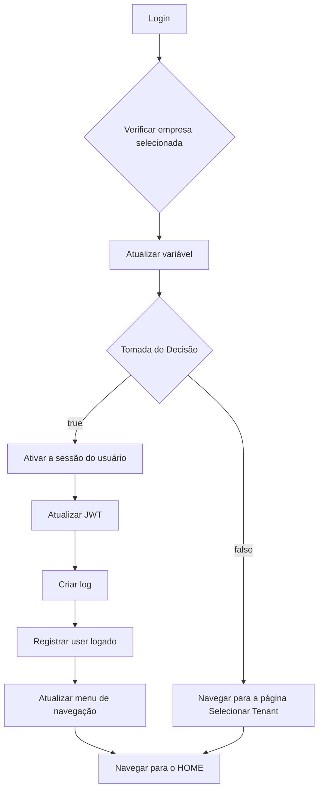

# Documento de Arquitetura: Fluxo de Autenticação Multi-Tenant

**Versão:** 2.0

**Objetivo:** Detalhar a arquitetura e a implementação do fluxo de autenticação e seleção de contexto (empresa) para a plataforma, garantindo segurança, escalabilidade e uma experiência de usuário coesa em um ambiente multi-tenant.

## Índice

- Bloco 1: Visão Geral e Fluxo de Ações
  - 1.1. Propósito e Decisões de Arquitetura
  - 1.2. Fluxograma de Ações
  - 1.3. Detalhamento das Etapas do Fluxo
- Bloco 2: Detalhamento da Edge Function get-user-memberships
  - 2.1. Introdução
  - 2.2. Motivo da Escolha: Por que uma Edge Function?
  - 2.3. Código da Função
  - 2.4. Conclusão do Bloco
- Bloco 3: Detalhamento da Edge Function select-company-session
  - 3.1. Introdução
  - 3.2. Motivo da Escolha: Por que uma Edge Function?
  - 3.3. Código da Função
  - 3.4. Conclusão do Bloco
- Conclusão Geral

## Bloco 1: Visão Geral e Fluxo de Ações

### 1.1. Propósito e Decisões de Arquitetura

Este documento detalha o processo de login seguro em um ambiente onde um único usuário pode pertencer a múltiplas empresas. O desafio central é garantir que, após a autenticação, a sessão do usuário seja inequivocamente associada a uma única empresa ("tenant"), e que todas as suas ações subsequentes sejam restritas ao contexto daquela empresa.

Para alcançar isso, foram tomadas duas decisões de arquitetura cruciais:

- **Uso de JSON Web Token (JWT) para Contexto:** A fonte da verdade para a sessão ativa é o `active_company_id`, que é injetado de forma segura nos metadados (`app_metadata`) do JWT do usuário. As regras de segurança do banco de dados (RLS) confiarão exclusivamente neste dado, garantindo performance e segurança máxima.
- **Orquestração com Edge Functions:** O processo de verificação de empresas e ativação da sessão é orquestrado por duas Edge Functions distintas. Essa escolha isola a lógica de negócio crítica em um ambiente de servidor seguro, que opera com privilégios de administrador para realizar as verificações e atualizações necessárias sem ser bloqueado pelas próprias regras de segurança que está tentando estabelecer.

### 1.2. Fluxograma de Ações

O fluxograma abaixo, extraído da implementação no WeWeb, ilustra visualmente o processo completo que ocorre imediatamente após o usuário submeter suas credenciais de login.



### 1.3. Detalhamento das Etapas do Fluxo

1.  **Login**: O processo começa com a ação padrão de `Sign In` do Supabase, onde o usuário é autenticado com email e senha. Um JWT inicial, contendo apenas a identidade do usuário (`user_id`), é gerado.
2.  **Verificar empresa selecionada**: Imediatamente após o sucesso do login, o workflow invoca a primeira Edge Function, `get-user-memberships`. Esta função verifica no banco de dados a quais empresas o usuário pertence.
3.  **Atualizar variável**: O resultado da função (uma lista de empresas) é armazenado em uma variável local no frontend para uso na próxima etapa.
4.  **Tomada de Decisão**: O sistema verifica o número de empresas retornadas.
    - **Caminho `false` (Múltiplas Empresas)**: Se o usuário pertencer a mais de uma empresa, ele é redirecionado para uma página de seleção, onde a lista de empresas é exibida para que ele escolha em qual deseja logar.
    - **Caminho `true` (Uma Única Empresa)**: Se o usuário pertencer a apenas uma empresa, o fluxo segue automaticamente para a próxima etapa.
5.  **Ativar a sessão do usuário**: O sistema invoca a segunda Edge Function, `select-company-session`, passando o `company_id` da empresa selecionada (seja de forma automática ou manual).
6.  **Atualizar JWT**: Após a segunda função executar com sucesso e atualizar o token no servidor, a ação `Refresh Session` é chamada no frontend para garantir que o cliente (navegador) obtenha o novo JWT, agora contendo o `active_company_id`.
7.  **Criar log**: Uma nova Edge Function é invocada para registrar o evento de login bem-sucedido, garantindo a rastreabilidade e a auditoria das ações do usuário.
8.  **Registrar user logado**: Um workflow do projeto é acionado para identificar o usuário logado e realizar quaisquer ações de inicialização necessárias.
9.  **Atualizar menu de navegação**: Os itens do menu de navegação são buscados (`Fetch collection`) para garantir que o usuário veja apenas as opções relevantes para sua função e permissões.
10. **Navegar para o HOME**: Finalmente, o usuário é redirecionado para a página inicial (`/home`), com a sessão devidamente segura e o contexto da empresa ativo.

## Bloco 2: Detalhamento da Edge Function get-user-memberships

### 2.1. Introdução

Esta função é a primeira etapa do nosso fluxo de segurança customizado. Sua única responsabilidade é atuar como um "verificador de acesso", respondendo à pergunta: "A quais empresas este usuário tem permissão para acessar?".

### 2.2. Motivo da Escolha: Por que uma Edge Function?

A escolha por uma Edge Function em vez de uma chamada RPC (função de banco de dados) é deliberada e crucial para a segurança:

- **Contexto de Execução:** Uma Edge Function roda em um ambiente de servidor seguro e utiliza o `service_role_key` do Supabase. Isso lhe confere privilégios de administrador, permitindo que ela ignore temporariamente as regras de segurança (RLS) para consultar a tabela de `memberships` e retornar apenas as empresas onde o status do membro está como 'ativo'.
- **Problema a ser Resolvido:** No momento do login, o JWT do usuário ainda não possui o `company_id`, que é essencial para as políticas de RLS. Uma chamada RPC normal seria bloqueada. A Edge Function, por sua vez, consegue consultar a tabela `memberships` de forma segura para "descobrir" as empresas do usuário e iniciar o processo de seleção de contexto.

### 2.3. Código da Função

O código abaixo é robusto, incluindo tipagem, validações de entrada e tratamento detalhado de erros para garantir a confiabilidade da função em produção.

**Arquivo:** `supabase/functions/get-user-memberships/index.ts`

```typescript
import { createClient } from 'https://esm.sh/@supabase/supabase-js@2';

const corsHeaders = {
  'Access-Control-Allow-Origin': '*',
  'Access-Control-Allow-Headers': 'authorization, x-client-info, apikey, content-type',
  'Access-Control-Allow-Methods': 'GET, POST, PUT, DELETE, OPTIONS',
};

interface Membership {
  company_id: string;
  companies: { name: string; };
}
interface SuccessResponse {
  memberships: Membership[];
  user_id: string;
}
interface ErrorResponse {
  error: string;
  details?: string;
}

Deno.serve(async (req) => {
  if (req.method === 'OPTIONS') {
    return new Response('ok', { headers: corsHeaders });
  }
  if (req.method !== 'GET') {
    return new Response(JSON.stringify({ error: 'Método não permitido. Use GET.' } as ErrorResponse), {
      headers: { ...corsHeaders, 'Content-Type': 'application/json' }, status: 405,
    });
  }
  try {
    const authHeader = req.headers.get('Authorization');
    if (!authHeader) {
      return new Response(JSON.stringify({ error: 'Header de autorização não encontrado.' } as ErrorResponse), {
        headers: { ...corsHeaders, 'Content-Type': 'application/json' }, status: 401,
      });
    }
    const token = authHeader.replace('Bearer ', '');
    if (!token || token === authHeader) {
      return new Response(JSON.stringify({ error: 'Token de autorização inválido.' } as ErrorResponse), {
        headers: { ...corsHeaders, 'Content-Type': 'application/json' }, status: 401,
      });
    }
    const supabaseUrl = Deno.env.get('SUPABASE_URL');
    const serviceRoleKey = Deno.env.get('SUPABASE_SERVICE_ROLE_KEY');
    if (!supabaseUrl || !serviceRoleKey) {
      console.error('Variáveis de ambiente do Supabase não configuradas');
      return new Response(JSON.stringify({ error: 'Erro de configuração do servidor.' } as ErrorResponse), {
        headers: { ...corsHeaders, 'Content-Type': 'application/json' }, status: 500,
      });
    }
    const supabaseAdmin = createClient(supabaseUrl, serviceRoleKey);
    const { data: { user }, error: authError } = await supabaseAdmin.auth.getUser(token);
    if (authError) {
      console.error('Erro de autenticação:', authError);
      return new Response(JSON.stringify({ error: 'Token de autorização inválido.', details: authError.message } as ErrorResponse), {
        headers: { ...corsHeaders, 'Content-Type': 'application/json' }, status: 401,
      });
    }
    if (!user) {
      return new Response(JSON.stringify({ error: 'Usuário não autenticado.' } as ErrorResponse), {
        headers: { ...corsHeaders, 'Content-Type': 'application/json' }, status: 401,
      });
    }
    const { data: memberships, error: membershipError } = await supabaseAdmin
      .from('memberships')
      .select('company_id, companies (name, cnpj, logo_url, status)')
      .eq('user_id', user.id)
      .eq('status', 'active')
      .order('created_at', { ascending: false });
    if (membershipError) {
      console.error('Erro ao consultar memberships:', membershipError);
      return new Response(JSON.stringify({ error: 'Erro ao consultar empresas do usuário.', details: membershipError.message } as ErrorResponse), {
        headers: { ...corsHeaders, 'Content-Type': 'application/json' }, status: 500,
      });
    }
    if (!memberships || memberships.length === 0) {
      return new Response(JSON.stringify({ error: 'Usuário não possui empresas ativas associadas.', memberships: [], user_id: user.id }), {
        headers: { ...corsHeaders, 'Content-Type': 'application/json' }, status: 200,
      });
    }
    return new Response(JSON.stringify({ memberships, user_id: user.id } as SuccessResponse), {
      headers: { ...corsHeaders, 'Content-Type': 'application/json' }, status: 200,
    });
  } catch (error) {
    console.error('Erro não tratado:', error);
    return new Response(JSON.stringify({ error: 'Erro interno do servidor.', details: error instanceof Error ? error.message : 'Erro desconhecido' } as ErrorResponse), {
      headers: { ...corsHeaders, 'Content-Type': 'application/json' }, status: 500,
    });
  }
});
```

### 2.4. Conclusão do Bloco

A função `get-user-memberships` é o ponto de partida essencial do nosso fluxo. Ela opera de forma segura para coletar as informações necessárias que permitirão ao frontend tomar a decisão correta sobre como prosseguir com o login do usuário.

## Bloco 3: Detalhamento da Edge Function select-company-session

### 3.1. Introdução

Esta função representa a etapa final e mais crítica do nosso fluxo de login. Sua responsabilidade é "ativar" oficialmente a sessão do usuário, vinculando-a de forma segura e definitiva a uma única empresa.

### 3.2. Motivo da Escolha: Por que uma Edge Function?

Assim como a função anterior, a escolha por uma Edge Function é motivada pela segurança:

- **Ação Privilegiada:** A atualização dos metadados de um usuário (`app_metadata`) é uma ação administrativa que não pode ser exposta diretamente ao cliente. A Edge Function atua como um intermediário seguro que valida a requisição antes de executar esta operação crítica.
- **Validação de Segurança:** Antes de atualizar o token, a função realiza uma verificação final e crucial: ela confirma no banco de dados se o usuário que está fazendo a requisição realmente pertence à empresa que ele diz querer acessar. Isso previne qualquer tentativa de manipulação por parte de um cliente mal-intencionado.

### 3.3. Código da Função

Este código é projetado para ser altamente seguro. Ele valida rigorosamente todos os dados de entrada, incluindo o formato do `company_id` (UUID), e fornece respostas de erro claras e específicas para cada cenário de falha.

**Arquivo:** `supabase/functions/select-company-session/index.ts`

```typescript
import { createClient } from 'https://esm.sh/@supabase/supabase-js@2';

const corsHeaders = {
  'Access-Control-Allow-Origin': '*',
  'Access-Control-Allow-Headers': 'authorization, x-client-info, apikey, content-type',
  'Access-Control-Allow-Methods': 'GET, POST, PUT, DELETE, OPTIONS',
};

interface RequestBody {
  company_id: string;
}
interface SuccessResponse {
  message: string;
  active_company_id: string;
  user_id: string;
}
interface ErrorResponse {
  error: string;
  details?: string;
}

Deno.serve(async (req) => {
  if (req.method === 'OPTIONS') {
    return new Response('ok', { headers: corsHeaders });
  }
  if (req.method !== 'POST') {
    return new Response(JSON.stringify({ error: 'Método não permitido. Use POST.' } as ErrorResponse), {
      headers: { ...corsHeaders, 'Content-Type': 'application/json' }, status: 405,
    });
  }
  try {
    const authHeader = req.headers.get('Authorization');
    if (!authHeader) {
      return new Response(JSON.stringify({ error: 'Header de autorização não encontrado.' } as ErrorResponse), {
        headers: { ...corsHeaders, 'Content-Type': 'application/json' }, status: 401,
      });
    }
    const token = authHeader.replace('Bearer ', '');
    if (!token || token === authHeader) {
      return new Response(JSON.stringify({ error: 'Token de autorização inválido.' } as ErrorResponse), {
        headers: { ...corsHeaders, 'Content-Type': 'application/json' }, status: 401,
      });
    }
    const supabaseUrl = Deno.env.get('SUPABASE_URL');
    const serviceRoleKey = Deno.env.get('SUPABASE_SERVICE_ROLE_KEY');
    if (!supabaseUrl || !serviceRoleKey) {
      console.error('Variáveis de ambiente do Supabase não configuradas');
      return new Response(JSON.stringify({ error: 'Erro de configuração do servidor.' } as ErrorResponse), {
        headers: { ...corsHeaders, 'Content-Type': 'application/json' }, status: 500,
      });
    }
    let requestBody: RequestBody;
    try {
      requestBody = await req.json();
    } catch (parseError) {
      return new Response(JSON.stringify({ error: 'Corpo da requisição inválido. Esperado JSON válido.', details: parseError instanceof Error ? parseError.message : 'Erro de parsing' } as ErrorResponse), {
        headers: { ...corsHeaders, 'Content-Type': 'application/json' }, status: 400,
      });
    }
    const { company_id } = requestBody;
    if (!company_id) {
      return new Response(JSON.stringify({ error: 'O campo company_id é obrigatório.' } as ErrorResponse), {
        headers: { ...corsHeaders, 'Content-Type': 'application/json' }, status: 400,
      });
    }
    const uuidRegex = /^[0-9a-f]{8}-[0-9a-f]{4}-[1-5][0-9a-f]{3}-[89ab][0-9a-f]{3}-[0-9a-f]{12}$/i;
    if (!uuidRegex.test(company_id)) {
      return new Response(JSON.stringify({ error: 'Formato de company_id inválido. Esperado UUID.' } as ErrorResponse), {
        headers: { ...corsHeaders, 'Content-Type': 'application/json' }, status: 400,
      });
    }
    const supabaseAdmin = createClient(supabaseUrl, serviceRoleKey);
    const { data: { user }, error: authError } = await supabaseAdmin.auth.getUser(token);
    if (authError) {
      console.error('Erro de autenticação:', authError);
      return new Response(JSON.stringify({ error: 'Token de autorização inválido.', details: authError.message } as ErrorResponse), {
        headers: { ...corsHeaders, 'Content-Type': 'application/json' }, status: 401,
      });
    }
    if (!user) {
      return new Response(JSON.stringify({ error: 'Usuário não autenticado.' } as ErrorResponse), {
        headers: { ...corsHeaders, 'Content-Type': 'application/json' }, status: 401,
      });
    }
    const { error: validationError } = await supabaseAdmin
      .from('memberships')
      .select('company_id')
      .eq('user_id', user.id)
      .eq('company_id', company_id)
      .eq('status', 'active')
      .single();
    if (validationError) {
      console.error('Erro ao validar membership:', validationError);
      if (validationError.code === 'PGRST116') {
        return new Response(JSON.stringify({ error: 'Acesso negado. Usuário não possui acesso ativo a esta empresa.' } as ErrorResponse), {
          headers: { ...corsHeaders, 'Content-Type': 'application/json' }, status: 403,
        });
      }
      return new Response(JSON.stringify({ error: 'Erro ao validar acesso à empresa.', details: validationError.message } as ErrorResponse), {
        headers: { ...corsHeaders, 'Content-Type': 'application/json' }, status: 500,
      });
    }
    const { error: updateError } = await supabaseAdmin.auth.admin.updateUserById(
      user.id,
      { app_metadata: { ...user.app_metadata, active_company_id: company_id } }
    );
    if (updateError) {
      console.error('Erro ao atualizar metadata do usuário:', updateError);
      return new Response(JSON.stringify({ error: 'Erro ao ativar sessão da empresa.', details: updateError.message } as ErrorResponse), {
        headers: { ...corsHeaders, 'Content-Type': 'application/json' }, status: 500,
      });
    }
    return new Response(JSON.stringify({ message: 'Sessão da empresa ativada com sucesso.', active_company_id: company_id, user_id: user.id } as SuccessResponse), {
      headers: { ...corsHeaders, 'Content-Type': 'application/json' }, status: 200,
    });
  } catch (error) {
    console.error('Erro não tratado:', error);
    return new Response(JSON.stringify({ error: 'Erro interno do servidor.', details: error instanceof Error ? error.message : 'Erro desconhecido' } as ErrorResponse), {
      headers: { ...corsHeaders, 'Content-Type': 'application/json' }, status: 500,
    });
  }
});
```

### 3.4. Conclusão do Bloco

A função `select-company-session` é o pilar que efetiva a segurança da sessão do usuário. Ao centralizar a lógica de validação e a operação privilegiada de atualização do token, ela garante que o contexto da empresa seja estabelecido de forma segura e à prova de falhas.

## Conclusão Geral

A arquitetura descrita neste documento estabelece um fluxo de autenticação e seleção de contexto que é, ao mesmo tempo, seguro e flexível. Através da orquestração com Edge Functions e da utilização do JWT como portador do contexto da sessão, criamos uma fundação sólida para a implementação das políticas de segurança em nível de banco de dados (RLS).

Este modelo garante que, independentemente da complexidade da aplicação, o isolamento de dados entre os diferentes tenants (empresas) seja mantido de forma rigorosa, que é o requisito mais fundamental de uma plataforma SaaS B2B. O próximo passo será a criação das funções auxiliares e das políticas de RLS no PostgreSQL, que consumirão o `active_company_id` do token para filtrar os dados em todas as consultas.
