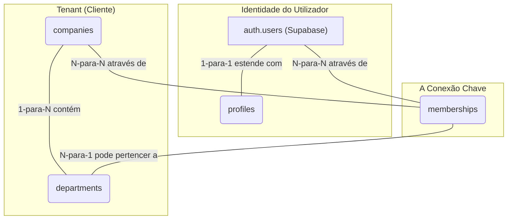
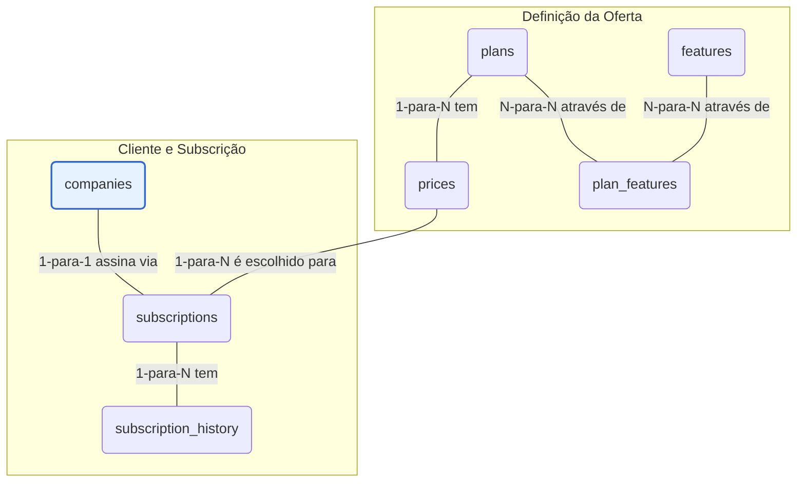
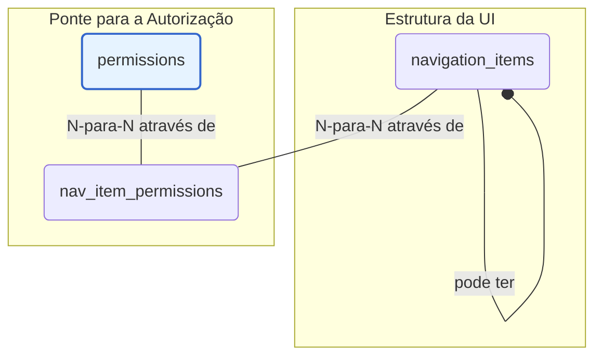
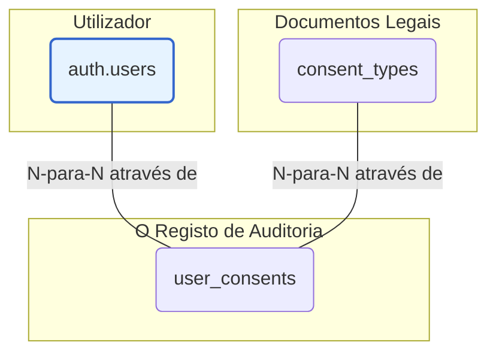

# Módulo de Fundação: Modelagem da Base de Dados

**Versão:** 1.2
**Data:** 02 de Setembro de 2025

---

## 1. Objetivo Geral da Seção

Esta seção detalha o esquema completo da base de dados no Supabase (PostgreSQL). O objetivo é estabelecer a fundação sobre a qual toda a lógica de negócio, segurança e funcionalidades serão construídas, garantindo integridade, escalabilidade e alinhamento com os requisitos de um sistema SaaS B-to-B multi-tenant.

---

## 2. Modelo de Dados por Domínio

### 2.1. Domínio: Identidade e Multi-Tenancy

#### Visão Geral Estratégica
Este módulo representa a fundação sobre a qual todo o sistema SaaS B-to-B é construído. Ele aborda dois dos desafios mais críticos de uma aplicação deste tipo:

- **Multi-Tenancy (Multi-Inquilino):** A capacidade de servir múltiplos clientes (empresas) a partir de uma única instância da aplicação, garantindo que os dados de um cliente (tenant) sejam total e inequivocamente isolados dos dados de todos os outros. Este é o pilar da segurança e da privacidade no nosso sistema.
- **Identidade:** A gestão de quem são os utilizadores, como eles se autenticam e como os seus perfis são representados dentro da aplicação.

A arquitetura deste módulo foi desenhada para ser segura, escalável e alinhada com as melhores práticas de desenvolvimento de software, garantindo que, à medida que a base de clientes cresce, a integridade e o isolamento dos dados permaneçam robustos.

#### Análise Detalhada das Tabelas e Suas Conexões
O diagrama de relacionamento deste módulo pode ser simplificado da seguinte forma:

**1. companies - O Pilar do Multi-Tenancy**
- **Finalidade e Motivação:** Esta é a tabela mais importante de todo o esquema. Cada linha em `companies` representa um cliente (um "tenant"). A existência desta tabela é a materialização da nossa estratégia de multi-tenancy. O `company_id` gerado aqui funcionará como uma "chave de partição" para quase todas as outras tabelas do sistema que contêm dados de clientes.
- **Decisões de Design:**
    - `id (UUID)`: Impede a enumeração de clientes, aumentando a segurança.
    - `cnpj (UNIQUE)`: Evita registos duplicados da mesma entidade legal.
    - `status`: Permite gerir o ciclo de vida do cliente (ativo, suspenso, etc.).
- [Ver detalhes da tabela `companies`](/docs/3-base-de-dados/tabelas/1-identidade-e-multi-tenancy/table_companies.md)

**2. profiles - A Extensão da Identidade**
- **Finalidade e Motivação:** Aplica o princípio da Separação de Responsabilidades ao estender a tabela `auth.users` do Supabase, mantendo os dados de perfil da aplicação (nome, avatar, etc.) sob nosso controlo.
- **Conexão e Integridade:** A relação 1-para-1 com `auth.users` é forçada pela PK de `profiles` ser também uma FK para `auth.users(id)`. O `ON DELETE CASCADE` garante a consistência dos dados.
- [Ver detalhes da tabela `profiles`](/docs/3-base-de-dados/tabelas/1-identidade-e-multi-tenancy/table_profiles.md)

**3. memberships - A Ponte entre Utilizadores e Empresas**
- **Finalidade e Motivação:** É a "cola" que une utilizadores e empresas, respondendo à pergunta: "Qual utilizador pertence a qual empresa?". É a fonte da verdade para o acesso aos dados de um tenant.
- **Conexão e Integridade:** Implementa uma relação N-para-N. A restrição `UNIQUE(user_id, company_id)` é vital para prevenir inconsistências.
- [Ver detalhes da tabela `memberships`](/docs/3-base-de-dados/tabelas/1-identidade-e-multi-tenancy/table_memberships.md)

**4. departments - Organização Interna do Tenant**
- **Finalidade e Motivação:** Permite a segmentação e organização de utilizadores dentro de um único cliente (ex: Financeiro, Vendas), servindo de base para permissões mais granulares.
- **Conexão e Integridade:** Relação 1-para-N com `companies`. `UNIQUE(name, company_id)` impede nomes de departamento duplicados na mesma empresa.
- [Ver detalhes da tabela `departments`](/docs/3-base-de-dados/tabelas/1-identidade-e-multi-tenancy/table_departments.md)

---

### 2.2. Domínio: Autorização e Permissões

Este domínio define o que um utilizador pode fazer dentro de uma empresa, utilizando uma abordagem híbrida que combina o melhor do ABAC (Attribute-Based Access Control) e do RBAC (Role-Based Access Control).

- **A Camada de Contexto: ABAC (Attribute-Based Access Control):** A permissão é decidida dinamicamente com base no contexto (quem, o quê, em que condições). A regra mais fundamental é um exemplo de ABAC: "um usuário só pode acessar os dados que pertencem à sua `company_id`".
- **A Estrutura de Cargos: RBAC (Role-Based Access Control):** Concede acesso com base em "cargos" (Roles) atribuídos aos usuários. A cadeia de relacionamentos é: `Usuário -> Membership -> Role -> Permission`.
- **Implementação Híbrida:** A lógica é garantida com RLS (Row-Level Security) no PostgreSQL para segurança máxima (ABAC) e controlo de visibilidade de elementos na UI com base nos papéis (RBAC).

**Tabelas do Domínio:**
- [`roles`](/docs/3-base-de-dados/tabelas/2-autorizacao-e-permissoes/table_roles.md)
- [`permissions`](/docs/3-base-de-dados/tabelas/2-autorizacao-e-permissoes/table_permissions.md)
- [`role_permissions`](/docs/3-base-de-dados/tabelas/2-autorizacao-e-permissoes/table_role_permissions.md)
- [`membership_roles`](/docs/3-base-de-dados/tabelas/2-autorizacao-e-permissoes/table_membership_roles.md)

---

### 2.3. Domínio: Planos e Monetização

Este módulo constitui a espinha dorsal comercial do sistema, gerindo o acesso dos clientes às funcionalidades com base no plano subscrito.

- **Flexibilidade:** Desacopla os conceitos de "plano", "preço" e "funcionalidade".
- **Integração:** Facilita a conexão com gateways de pagamento como o Stripe.
- **Auditabilidade:** Mantém um registo detalhado das alterações nas subscrições.

**Tabelas do Domínio:**
- [`features`](/docs/3-base-de-dados/tabelas/3-planos-e-monetizacao/table_features.md)
- [`plans`](/docs/3-base-de-dados/tabelas/3-planos-e-monetizacao/table_plans.md)
- [`prices`](/docs/3-base-de-dados/tabelas/3-planos-e-monetizacao/table_prices.md)
- [`subscriptions`](/docs/3-base-de-dados/tabelas/3-planos-e-monetizacao/table_subscriptions.md)
- [`subscription_history`](/docs/3-base-de-dados/tabelas/3-planos-e-monetizacao/table_subscription_history.md)
- [`plan_features`](/docs/3-base-de-dados/tabelas/3-planos-e-monetizacao/table_plan_features.md)

---

### 2.4. Domínio: Interface e Navegação

Este módulo serve como a ponte entre a lógica de autorização do back-end e a experiência do utilizador no front-end, definindo o que um utilizador pode *ver*.

- **Dinamismo:** Permite modificar a navegação sem necessidade de deploy do front-end.
- **Segurança por Design:** Oculta links para secções não autorizadas.
- **Centralização:** A estrutura da UI e as suas regras de acesso estão centralizadas.

**Tabelas do Domínio:**
- [`navigation_items`](/docs/3-base-de-dados/tabelas/4-interface-e-navegacao/table_navigation_items.md)
- [`nav_item_permissions`](/docs/3-base-de-dados/tabelas/4-interface-e-navegacao/table_nav_item_permissions.md)

---

### 2.5. Domínio: Conformidade e Auditoria

Este módulo aborda a gestão de consentimento e a manutenção de trilhas de auditoria, essenciais para a conformidade com regulamentações como LGPD/GDPR.

- **Gestão de Consentimento:** Garante o consentimento explícito para documentos legais.
- **Versionamento:** Gere eficazmente as atualizações desses documentos.
- **Auditabilidade:** Mantém um registo imutável de qual utilizador aceitou qual versão de um documento e quando.

**Tabelas do Domínio:**
- [`consent_types`](/docs/3-base-de-dados/tabelas/5-conformidade-e-auditoria/table_consent_types.md)
- [`user_consents`](/docs/3-base-de-dados/tabelas/5-conformidade-e-auditoria/table_user_consents.md)

---

## 5. Conclusão

O esquema da base de dados aqui detalhado estabelece uma fundação robusta e coesa para um sistema SaaS B-to-B. Através da separação lógica em domínios distintos, criamos um modelo que é ao mesmo tempo seguro, escalável e de fácil manutenção.
