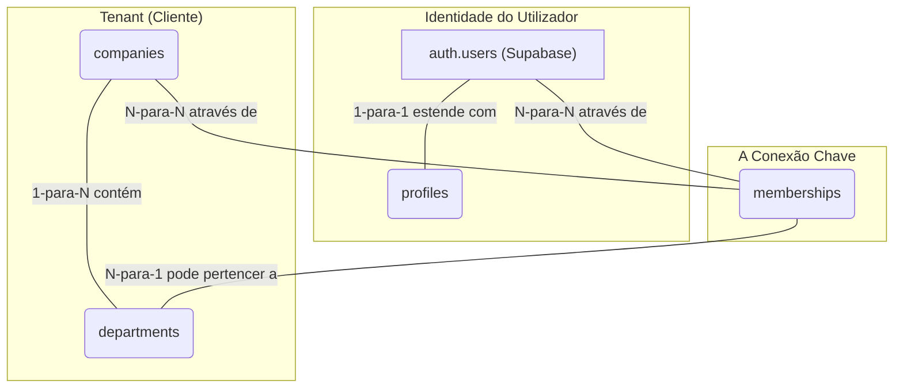
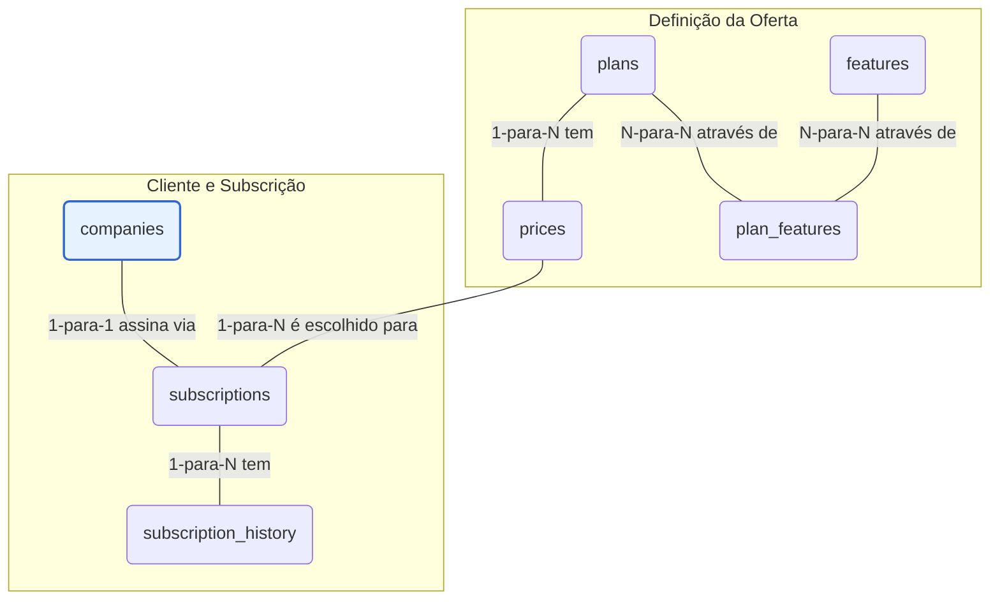
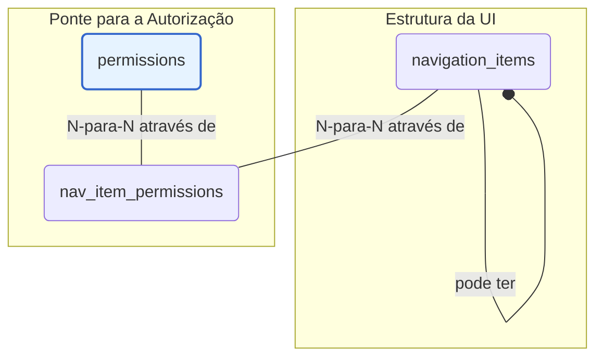
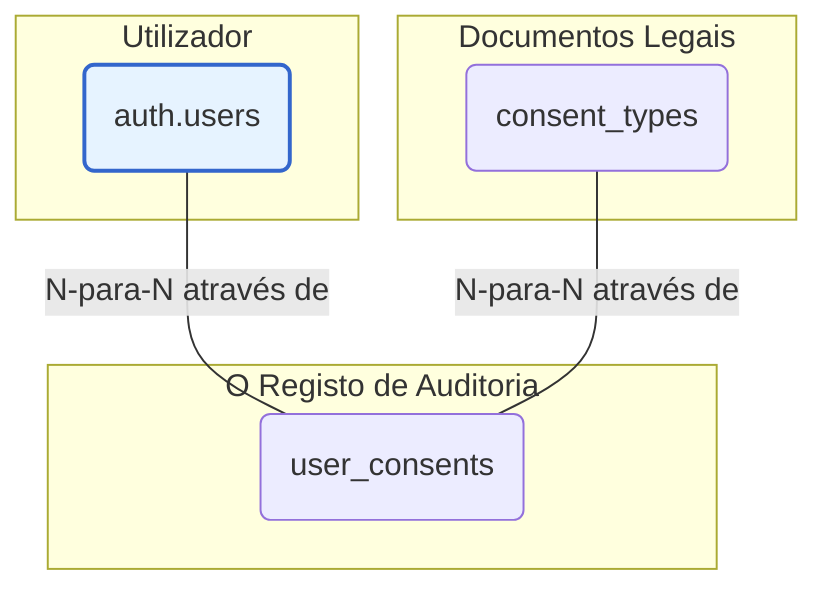
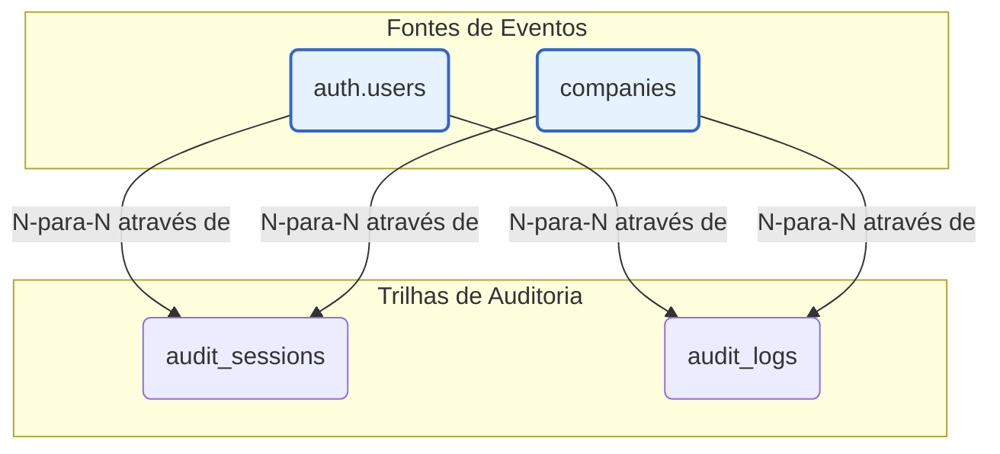

# Módulo de Fundação: Modelagem da Base de Dados

**Versão:** 1.2
**Data:** 02 de Setembro de 2025

---

## 1. Objetivo Geral da Seção

Esta seção detalha o esquema completo da base de dados no Supabase (PostgreSQL). O objetivo é estabelecer a fundação sobre a qual toda a lógica de negócio, segurança e funcionalidades serão construídas, garantindo integridade, escalabilidade e alinhamento com os requisitos de um sistema SaaS B2B multi-tenant.

---

## 2. Modelo de Dados por Domínio

### 2.1. Domínio: Identidade e Multi-Tenancy

#### Visão Geral Estratégica
Este módulo representa a fundação sobre a qual todo o sistema SaaS B2B é construído. Ele aborda dois dos desafios mais críticos de uma aplicação deste tipo:

- **Multi-Tenancy (Multi-Inquilino):** A capacidade de servir múltiplos clientes (empresas) a partir de uma única instância da aplicação, garantindo que os dados de um cliente (tenant) sejam total e inequivocamente isolados dos dados de todos os outros. Este é o pilar da segurança e da privacidade no nosso sistema.
- **Identidade:** A gestão de quem são os utilizadores, como eles se autenticam e como os seus perfis são representados dentro da aplicação.

A arquitetura deste módulo foi desenhada para ser segura, escalável e alinhada com as melhores práticas de desenvolvimento de software, garantindo que, à medida que a base de clientes cresce, a integridade e o isolamento dos dados permaneçam robustos.

#### Análise Detalhada das Tabelas e Suas Conexões
O diagrama de relacionamento deste módulo pode ser simplificado da seguinte forma:



**1. companies - O Pilar do Multi-Tenancy**
- **Finalidade e Motivação:** Esta é a tabela mais importante de todo o esquema. Cada linha em `companies` representa um cliente (um "tenant"). A existência desta tabela é a materialização da nossa estratégia de multi-tenancy. O `company_id` gerado aqui funcionará como uma "chave de partição" para quase todas as outras tabelas do sistema que contêm dados de clientes.
- **Decisões de Design:**
    - `id (UUID)`: Impede a enumeração de clientes, aumentando a segurança.
    - `cnpj (UNIQUE)`: Evita registos duplicados da mesma entidade legal.
    - `status`: Permite gerir o ciclo de vida do cliente (ativo, suspenso, etc.).
- [Ver detalhes da tabela `companies`](/docs/3-base-de-dados/tabelas/1-identidade-e-multi-tenancy/table_companies.md)

**2. profiles - A Extensão da Identidade**
- **Finalidade e Motivação:** Aplica o princípio da Separação de Responsabilidades ao estender a tabela `auth.users` do Supabase, mantendo os dados de perfil da aplicação (nome, avatar, etc.) sob nosso controlo.
- **Conexão e Integridade:** A relação 1-para-1 com `auth.users` é forçada pela PK de `profiles` ser também uma FK para `auth.users(id)`. O `ON DELETE CASCADE` garante a consistência dos dados.
- [Ver detalhes da tabela `profiles`](/docs/3-base-de-dados/tabelas/1-identidade-e-multi-tenancy/table_profiles.md)

**3. memberships - A Ponte entre Utilizadores e Empresas**
- **Finalidade e Motivação:** É a "cola" que une utilizadores e empresas, respondendo à pergunta: "Qual utilizador pertence a qual empresa?". É a fonte da verdade para o acesso aos dados de um tenant.
- **Conexão e Integridade:** Implementa uma relação N-para-N. A restrição `UNIQUE(user_id, company_id)` é vital para prevenir inconsistências.
- [Ver detalhes da tabela `memberships`](/docs/3-base-de-dados/tabelas/1-identidade-e-multi-tenancy/table_memberships.md)

**4. departments - Organização Interna do Tenant**
- **Finalidade e Motivação:** Permite a segmentação e organização de utilizadores dentro de um único cliente (ex: Financeiro, Vendas), servindo de base para permissões mais granulares.
- **Conexão e Integridade:** Relação 1-para-N com `companies`. `UNIQUE(name, company_id)` impede nomes de departamento duplicados na mesma empresa.
- [Ver detalhes da tabela `departments`](/docs/3-base-de-dados/tabelas/1-identidade-e-multi-tenancy/table_departments.md)

---

### 2.2. Domínio: Autorização e Permissões

Este domínio define o que um utilizador pode fazer dentro de uma empresa, utilizando uma abordagem híbrida que combina o melhor do ABAC (Attribute-Based Access Control) e do RBAC (Role-Based Access Control).

- **A Camada de Contexto: ABAC (Attribute-Based Access Control):** A permissão é decidida dinamicamente com base no contexto (quem, o quê, em que condições). A regra mais fundamental é um exemplo de ABAC: "um usuário só pode acessar os dados que pertencem à sua `company_id`".
- **A Estrutura de Cargos: RBAC (Role-Based Access Control):** Concede acesso com base em "cargos" (Roles) atribuídos aos usuários. A cadeia de relacionamentos é: `Usuário -> Membership -> Role -> Permission`.
- **Implementação Híbrida:** A lógica é garantida com RLS (Row-Level Security) no PostgreSQL para segurança máxima (ABAC) e controlo de visibilidade de elementos na UI com base nos papéis (RBAC).

**Tabelas do Domínio:**
- [`roles`](/docs/3-base-de-dados/tabelas/2-autorizacao-e-permissoes/table_roles.md)
- [`permissions`](/docs/3-base-de-dados/tabelas/2-autorizacao-e-permissoes/table_permissions.md)
- [`role_permissions`](/docs/3-base-de-dados/tabelas/2-autorizacao-e-permissoes/table_role_permissions.md)
- [`membership_roles`](/docs/3-base-de-dados/tabelas/2-autorizacao-e-permissoes/table_membership_roles.md)

---

### 2.3. Domínio: Planos e Monetização

Este módulo constitui a espinha dorsal comercial do sistema, gerindo o acesso dos clientes às funcionalidades com base no plano subscrito.

- **Flexibilidade:** Desacopla os conceitos de "plano", "preço" e "funcionalidade".
- **Integração:** Facilita a conexão com gateways de pagamento como o Stripe.
- **Auditabilidade:** Mantém um registo detalhado das alterações nas subscrições.



**Tabelas do Domínio:**
- [`features`](/docs/3-base-de-dados/tabelas/3-planos-e-monetizacao/table_features.md)
- [`plans`](/docs/3-base-de-dados/tabelas/3-planos-e-monetizacao/table_plans.md)
- [`prices`](/docs/3-base-de-dados/tabelas/3-planos-e-monetizacao/table_prices.md)
- [`subscriptions`](/docs/3-base-de-dados/tabelas/3-planos-e-monetizacao/table_subscriptions.md)
- [`subscription_history`](/docs/3-base-de-dados/tabelas/3-planos-e-monetizacao/table_subscription_history.md)
- [`plan_features`](/docs/3-base-de-dados/tabelas/3-planos-e-monetizacao/table_plan_features.md)

---

### 2.4. Domínio: Interface e Navegação

Este módulo serve como a ponte entre a lógica de autorização do back-end e a experiência do utilizador no front-end, definindo o que um utilizador pode *ver*.

- **Dinamismo:** Permite modificar a navegação sem necessidade de deploy do front-end.
- **Segurança por Design:** Oculta links para secções não autorizadas.
- **Centralização:** A estrutura da UI e as suas regras de acesso estão centralizadas.



**Tabelas do Domínio:**
- [`navigation_items`](/docs/3-base-de-dados/tabelas/4-interface-e-navegacao/table_navigation_items.md)
- [`nav_item_permissions`](/docs/3-base-de-dados/tabelas/4-interface-e-navegacao/table_nav_item_permissions.md)

---

### 2.5. Domínio: Conformidade e Auditoria

Este módulo aborda a gestão de consentimento e a manutenção de trilhas de auditoria, essenciais para a conformidade com regulamentações como LGPD/GDPR.

- **Gestão de Consentimento:** Garante o consentimento explícito para documentos legais.
- **Versionamento:** Gere eficazmente as atualizações desses documentos.
- **Auditabilidade:** Mantém um registo imutável de qual utilizador aceitou qual versão de um documento e quando.



**Tabelas do Domínio:**
- [`consent_types`](/docs/3-base-de-dados/tabelas/5-conformidade-e-auditoria/table_consent_types.md)
- [`user_consents`](/docs/3-base-de-dados/tabelas/5-conformidade-e-auditoria/table_user_consents.md)

---


### 2.6. Domínio: Logs de Auditoria

Este módulo é dedicado a rastrear e registrar todas as ações significativas que ocorrem no sistema, fornecendo uma trilha de auditoria completa. É essencial para a segurança, conformidade e para a capacidade de resposta a incidentes.

- **Rastreabilidade:** Garante que cada ação possa ser atribuída a um usuário e a uma sessão.
- **Segurança:** Ajuda a detectar atividades anômalas ou não autorizadas.
- **Imutabilidade:** Os logs são projetados para serem registros históricos que não devem ser alterados.



**Tabelas do Domínio:**
- [`audit_sessions`](/docs/3-base-de-dados/tabelas/6-audit-logs/audit_sessions.md)
- [`audit_logs`](/docs/3-base-de-dados/tabelas/6-audit-logs/audit_logs.md)

---

## 5. Conclusão

O esquema da base de dados aqui detalhado estabelece uma fundação robusta e coesa para um sistema SaaS B-to-B. Através da separação lógica em domínios distintos, criamos um modelo que é ao mesmo tempo seguro, escalável e de fácil manutenção.

---
# Tabela: audit_sessions

## Finalidade e Justificativa

Esta tabela é um pilar fundamental da segurança e monitoramento do sistema. Ela funciona como um diário de bordo para o ciclo de vida de cada sessão de usuário, registrando eventos cruciais como logins bem-sucedidos (`LOGIN_SUCCESS`), logouts (`LOGOUT`) e, de forma muito importante, tentativas de login que falharam (`LOGIN_FAILURE`).

Manter um registro detalhado desses eventos nos permite não só entender quando e como os usuários acessam o sistema, mas também identificar atividades suspeitas, como tentativas de acesso não autorizado, fornecendo uma camada essencial para a segurança da aplicação.

## DDL (SQL)

```sql
-- DESCRIÇÃO: Cria um tipo ENUM para garantir que os eventos de sessão sejam padronizados.
-- EXECUÇÃO: Execute este script uma única vez.
CREATE TYPE public.session_event_type AS ENUM ('LOGIN_SUCCESS', 'LOGOUT', 'LOGIN_FAILURE');

create table public.audit_sessions (
  id uuid not null default gen_random_uuid (),
  session_id uuid null,
  company_id uuid null,
  user_id uuid null,
  event_type public.session_event_type not null,
  ip_address inet null,
  user_agent text null,
  payload jsonb null,
  created_at timestamp with time zone not null default now(),
  severity public.severity null,
  constraint audit_sessions_pkey primary key (id),
  constraint audit_sessions_company_id_fkey foreign KEY (company_id) references companies (id) on delete CASCADE,
  constraint audit_sessions_user_id_fkey foreign KEY (user_id) references auth.users (id) on delete set null
) TABLESPACE pg_default;

create index IF not exists idx_audit_sessions_company_id on public.audit_sessions using btree (company_id) TABLESPACE pg_default;
create index IF not exists idx_audit_sessions_user_id on public.audit_sessions using btree (user_id) TABLESPACE pg_default;
create index IF not exists idx_audit_sessions_session_id on public.audit_sessions using btree (session_id) TABLESPACE pg_default;
create index IF not exists idx_audit_sessions_created_at on public.audit_sessions using btree (created_at) TABLESPACE pg_default;

COMMENT ON COLUMN public.audit_sessions.session_id IS 'ID da sessão de auth.sessions, para correlação direta';
COMMENT ON COLUMN public.audit_sessions.payload IS 'Para detalhes extras, como motivo da falha de login';
```

## Campos e Restrições

*   **id (UUID, PK):** Chave primária da tabela.
*   **session\_id (UUID):** ID da sessão de `auth.sessions`, para correlação direta.
*   **company\_id (UUID):** ID da empresa à qual a sessão pertence.
*   **user\_id (UUID):** ID do usuário associado à sessão.
*   **event\_type (ENUM):** Tipo de evento de sessão (`LOGIN_SUCCESS`, `LOGOUT`, `LOGIN_FAILURE`).
*   **ip\_address (INET):** Endereço IP de origem da solicitação.
*   **user\_agent (TEXT):** User agent do cliente.
*   **payload (JSONB):** Dados adicionais sobre o evento (ex: motivo da falha de login).
*   **created\_at (TIMESTAMPZ):** Data e hora da criação do registro.
*   **severity (public.severity):** Nível de severidade do evento.

## Políticas de Row Level Security (RLS)

```sql
CREATE POLICY "Permitir leitura granular de logs de sessão"
ON public.audit_sessions FOR SELECT
USING (
    ((company_id = custom_auth_helpers.current_company_id()) AND custom_auth_helpers.has_permission('audit.read.total'))
    OR
    ((company_id = custom_auth_helpers.current_company_id()) AND custom_auth_helpers.has_permission('audit.read') AND user_id = auth.uid())
);
```

## Notas

Esta tabela é o diário de bordo do ciclo de vida de cada sessão de usuário. A política de leitura é dividida em duas condições principais, funcionando como um sistema de "OU": o usuário precisa atender à primeira OU à segunda condição para ver os dados.

### Cenário A: O Administrador da Empresa

*   **Quem:** Um usuário com a permissão `audit.read.total`.
*   **O que pode ver:** Ele pode ver todos os logs de sessão de todos os usuários da sua própria empresa.
*   **Exemplo:** Um administrador de segurança precisa investigar uma série de tentativas de login falhadas para uma conta de usuário. Ele consegue visualizar a lista completa de logs de sessão da empresa e filtrar pelos eventos de `LOGIN_FAILURE`.

### Cenário B: O Usuário Comum

*   **Quem:** Um usuário com a permissão `audit.read`, mas sem a `audit.read.total`.
*   **O que pode ver:** Ele pode ver apenas os seus próprios logs de sessão.
*   **Exemplo:** Carlos, um usuário, quer verificar o histórico de seus logins recentes para garantir que sua conta não foi acessada indevidamente. Ele pode acessar a tela de auditoria e verá apenas os eventos de login e logout associados à sua própria conta. Ele não consegue ver os logs de sessão de outros usuários.

---
# Tabela: audit_logs

## Finalidade e Justificativa

Enquanto a tabela `audit_sessions` foca nos eventos de entrada e saída (login/logout), a `audit_logs` é o coração do nosso sistema de auditoria detalhada. É aqui que cada ação específica – desde a criação de um novo departamento até a atualização de um perfil de usuário – será registrada.

Esta tabela nos dará uma visão granular de "quem", "o quê" e "quando" para todas as operações críticas do sistema, servindo como a fonte principal de verdade para qualquer investigação ou análise de atividade.

## DDL (SQL)

```sql
-- DESCRIÇÃO: Tabela principal para todos os logs de ações detalhadas.
-- EXECUÇÃO: Execute este script uma única vez.
create table public.audit_logs (
  id bigserial not null,
  company_id uuid not null,
  user_id uuid null,
  session_id uuid null,
  action text not null,
  target_entity text null,
  target_id text null,
  payload jsonb null,
  created_at timestamp with time zone not null default now(),
  constraint audit_logs_pkey primary key (id),
  constraint audit_logs_company_id_fkey foreign KEY (company_id) references companies (id) on delete CASCADE,
  constraint audit_logs_user_id_fkey foreign KEY (user_id) references auth.users (id) on delete set null
) TABLESPACE pg_default;

create index IF not exists idx_audit_logs_company_id_created_at on public.audit_logs using btree (company_id, created_at desc) TABLESPACE pg_default;
create index IF not exists idx_audit_logs_user_id on public.audit_logs using btree (user_id) TABLESPACE pg_default;
create index IF not exists idx_audit_logs_session_id on public.audit_logs using btree (session_id) TABLESPACE pg_default;
create index IF not exists idx_audit_logs_action on public.audit_logs using btree (action) TABLESPACE pg_default;
create index IF not exists idx_audit_logs_payload_gin on public.audit_logs using gin (payload) TABLESPACE pg_default;

COMMENT ON COLUMN public.audit_logs.action IS 'Ação normalizada, ex: ''product.create'', ''profile.update''';
COMMENT ON COLUMN public.audit_logs.target_entity IS 'Nome da tabela ou entidade de negócio afetada, ex: ''departments''';
COMMENT ON COLUMN public.audit_logs.target_id IS 'ID (UUID, INT, etc.) do registro afetado, como texto';
```

## Campos e Restrições

*   **id (BIGSERIAL, PK):** Chave primária da tabela.
*   **company\_id (UUID):** ID da empresa à qual o log pertence.
*   **user\_id (UUID):** ID do usuário que realizou a ação.
*   **session\_id (UUID):** ID da sessão do usuário.
*   **action (TEXT):** Ação normalizada (ex: 'product.create', 'profile.update').
*   **target\_entity (TEXT):** Nome da tabela ou entidade de negócio afetada.
*   **target\_id (TEXT):** ID do registro afetado.
*   **payload (JSONB):** Dados adicionais sobre a ação.
*   **created\_at (TIMESTAMPZ):** Data e hora da criação do registro.

## Políticas de Row Level Security (RLS)

```sql
CREATE POLICY "Permitir leitura granular de logs de auditoria"
ON public.audit_logs FOR SELECT
USING (
    ((company_id = custom_auth_helpers.current_company_id()) AND custom_auth_helpers.has_permission('audit.read.total'))
    OR
    ((company_id = custom_auth_helpers.current_company_id()) AND custom_auth_helpers.has_permission('audit.read') AND user_id = auth.uid())
);

CREATE POLICY "Users can insert audit logs for their company"
ON public.audit_logs FOR INSERT TO authenticated
WITH CHECK ( company_id = (SELECT get_my_active_company_id()) );
```

## Notas

Esta tabela é o coração do nosso sistema de auditoria detalhada.

### 1. Quem pode LER o quê? (Políticas de SELECT)

A política de leitura é dividida em duas condições principais, funcionando como um sistema de "OU": o usuário precisa atender à primeira OU à segunda condição para ver os dados.

#### Cenário A: O Administrador da Empresa

*   **Quem:** Um usuário com a permissão `audit.read.total`.
*   **O que pode ver:** Ele pode ver todos os logs de auditoria de todos os usuários da sua própria empresa.
*   **Exemplo:** Um gerente de TI precisa investigar uma alteração suspeita feita em um departamento. Ele consegue visualizar a lista completa de logs da empresa e filtrar pelas ações do usuário em questão.

#### Cenário B: O Usuário Comum

*   **Quem:** Um usuário com a permissão `audit.read`, mas sem a `audit.read.total`.
*   **O que pode ver:** Ele pode ver apenas os seus próprios logs de auditoria.
*   **Exemplo:** Ana, uma colaboradora, quer verificar quando ela atualizou seu perfil pela última vez. Ela pode acessar a tela de auditoria e verá apenas as ações que ela mesma realizou. Ela não consegue, de forma alguma, ver os logs de Beto, seu colega.

### 2. Quem pode CRIAR o quê? (Política de INSERT)

A política de inserção é mais simples e funciona como uma barreira de segurança.

*   **Quem:** Qualquer usuário autenticado no sistema.
*   **O que pode criar:** Um novo registro na tabela `audit_logs`.
*   **A Regra (WITH CHECK):** A política impõe uma verificação crucial: o `company_id` do novo log que está sendo inserido deve ser igual ao `company_id` ativo do usuário que está realizando a ação.
*   **Exemplo Prático:** Quando um usuário do WeWeb clica em um botão que chama a nossa Edge Function para registrar um log, esta política garante que ele só pode criar logs para a empresa à qual ele pertence e está logado. Isso impede que um usuário da "Empresa X" consiga, acidentalmente ou maliciosamente, inserir um registro de log no espaço da "Empresa Y".

Em resumo, essas regras garantem que os dados de auditoria sejam tanto **privados** (usuários só veem o que lhes é permitido) quanto **íntegros** (os logs são sempre associados à empresa correta).
