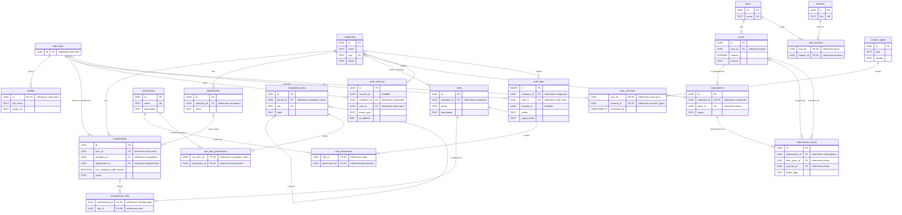

# Diagrama Entidade Relacionamento (ERD)

Este documento apresenta o diagrama entidade-relacionamento da base de dados, ilustrando as tabelas, seus campos e as conexões entre elas.

```mermaid
---
theme: dark
---
erDiagram
    %% --- 1. Domínio: Identidade e Multi-Tenancy ---
    "auth.users" {
        UUID id PK "Supabase Auth User"
    }

    companies {
        UUID id PK
        TEXT name
        TEXT cnpj UK
        TEXT status
    }

    profiles {
        UUID id PK, FK "references auth.users"
        TEXT full_name
        TEXT avatar_url
    }

    departments {
        UUID id PK
        UUID company_id FK "references companies"
        TEXT name
    }

    memberships {
        UUID id PK
        UUID user_id FK "references auth.users"
        UUID company_id FK "references companies"
        UUID department_id FK "references departments"
        BOOLEAN has_company_wide_access
        TEXT status
    }

    "auth.users" ||--o{ profiles : "possui"
    "auth.users" ||--|{ memberships : "pode ser membro de"
    companies ||--|{ memberships : "tem"
    companies ||--|{ departments : "tem"
    departments |o--o{ memberships : "pode conter"


    %% --- 2. Domínio: Autorização e Permissões ---
    roles {
        UUID id PK
        UUID company_id FK "references companies"
        TEXT name
        TEXT description
    }

    permissions {
        UUID id PK
        TEXT name UK
        TEXT description
    }

    membership_roles {
        UUID membership_id PK, FK "references memberships"
        UUID role_id PK, FK "references roles"
    }

    role_permissions {
        UUID role_id PK, FK "references roles"
        UUID permission_id PK, FK "references permissions"
    }

    memberships ||--|{ membership_roles : "possui"
    roles ||--|{ membership_roles : "é atribuído a"
    roles ||--|{ role_permissions : "contém"
    permissions ||--|{ role_permissions : "é parte de"
    companies |o--|{ roles : "pode customizar"


    %% --- 3. Domínio: Planos e Monetização ---
    plans {
        UUID id PK
        TEXT name UK
    }

    features {
        UUID id PK
        TEXT key UK
    }

    plan_features {
        UUID plan_id PK, FK "references plans"
        UUID feature_id PK, FK "references features"
    }

    prices {
        UUID id PK
        UUID plan_id FK "references plans"
        INTEGER amount
        TEXT interval
    }

    subscriptions {
        UUID id PK
        UUID company_id UK, FK "references companies"
        UUID price_id FK "references prices"
        TEXT status
    }

    subscription_history {
        UUID id PK
        UUID subscription_id FK "references subscriptions"
        UUID from_price_id FK "references prices"
        UUID to_price_id FK "references prices"
        TEXT event_type
    }

    plans ||--|{ prices : "tem"
    plans ||--|{ plan_features : "inclui"
    features ||--|{ plan_features : "está em"
    companies |o--|| subscriptions : "assina"
    prices ||--|{ subscriptions : "é comprada via"
    subscriptions ||--|{ subscription_history : "tem histórico de"
    prices |o--o{ subscription_history : "é origem de"
    prices |o--o{ subscription_history : "é destino de"


    %% --- 4. Domínio: Interface e Navegação ---
    navigation_items {
        UUID id PK
        UUID parent_id FK "references navigation_items"
        TEXT key UK
        TEXT label
    }

    nav_item_permissions {
        UUID nav_item_id PK, FK "references navigation_items"
        UUID permission_id PK, FK "references permissions"
    }

    navigation_items |o--o{ navigation_items : "é pai de"
    navigation_items ||--|{ nav_item_permissions : "requer"
    permissions ||--|{ nav_item_permissions : "controla acesso a"


    %% --- 5. Domínio: Conformidade e Auditoria ---
    consent_types {
        UUID id PK
        TEXT type
        TEXT version
    }

    user_consents {
        UUID user_id PK, FK "references auth.users"
        UUID consent_id PK, FK "references consent_types"
        TIMESTAMPTZ consented_at
    }

    "auth.users" ||--|{ user_consents : "dá"
    consent_types ||--|{ user_consents : "recebe"

    %% --- 6. Domínio: Logs de Auditoria ---
    audit_sessions {
        UUID id PK
        UUID session_id "Nullable"
        UUID company_id FK "references companies"
        UUID user_id FK "references auth.users"
        TEXT event_type
        INET ip_address
    }

    audit_logs {
        BIGINT id PK
        UUID company_id FK "references companies"
        UUID user_id FK "references auth.users"
        UUID session_id "Nullable"
        TEXT action
        TEXT target_entity
    }

    "auth.users" |o--o{ audit_sessions : "gera"
    companies |o--o{ audit_sessions : "registra"
    "auth.users" |o--o{ audit_logs : "executa"
    companies |o--o{ audit_logs : "registra"
```
